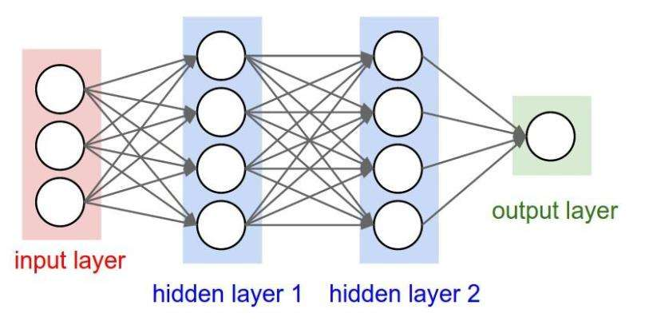

# COMPUTER-VISION  

This project is a comprehensive collection of computer vision examples aimed at assisting undergraduate students in learning and understanding the fundamental concepts and techniques of computer vision.

## BGR2HSI_BGR2HSV  

编写程序，实现1.jpg的BGR色彩空间与HSI、HSV色彩空间之间的转换。  

（根据色彩原理编写转换代码，并将处理结果与OpenCV自带函数处理结果做对比）

## Image-Preprocessing

1.在一个程序中，分别采用最大值法，平均值法和加权平均法对image1进行灰度化处理；  
2.在一个程序中，对image1分别进行平移，縮放，旋转等处理操作；（先将原图给小，再进行几何变换。）  
3.在一个程序中，对image2进行直方图均衡化处理；  
4.在一个程序中，分别采用均值滤波，中值滤波和高斯滤波方法对image3进行去噪声处理；  

（根据各图像处理原理编写代码，并将处理结果与OpenCV自带函数处理结果做对比）   

## Line-Detection  

1.首先，读取图像(若为彩色图像，需将彩色图像转换为灰度图像);  
2.对图像进行边缘检测，可采用Canny算子检测方法，显示边缘检测结果图像，并保存边缘检测结果图像，命名为Cannyedge.jpg;  
3.在2边缘检测结果的基础上，使用cv2.HughLines()函数和cv2.HoughLinesP()函数分别对图像进行标准霍夫直线和概率霍夫直线的检测，并在图中分别用红色和绿色线段标识出两个函数检测出的直线，分别显示检测结果  
4.保存3中红色和绿色线段标识出检测直线的图像，分别命名为HoughLines.jpg和HoughLinesP.jpg  
