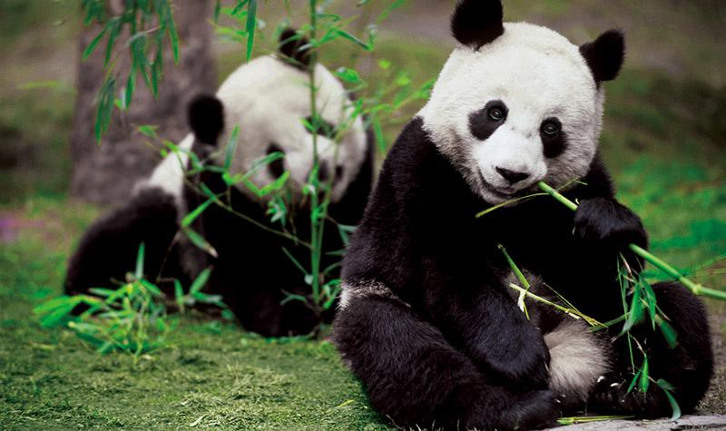
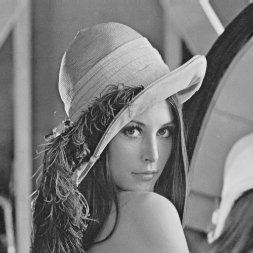

# Image-Preprocessing

## 要求    
1.在一个程序中，分别采用最大值法，平均值法和加权平均法对image1进行灰度化处理；  
2.在一个程序中，对image1分别进行平移，縮放，旋转等处理操作；（先将原图给小，再进行几何变换。）  
3.在一个程序中，对image2进行直方图均衡化处理；  
4.在一个程序中，分别采用均值滤波，中值滤波和高斯滤波方法对image3进行去噪声处理；  
  
（根据各图像处理原理编写代码，并将处理结果与opencv自带函数处理结果做对比）  

## 示例图片  

  
  
  
